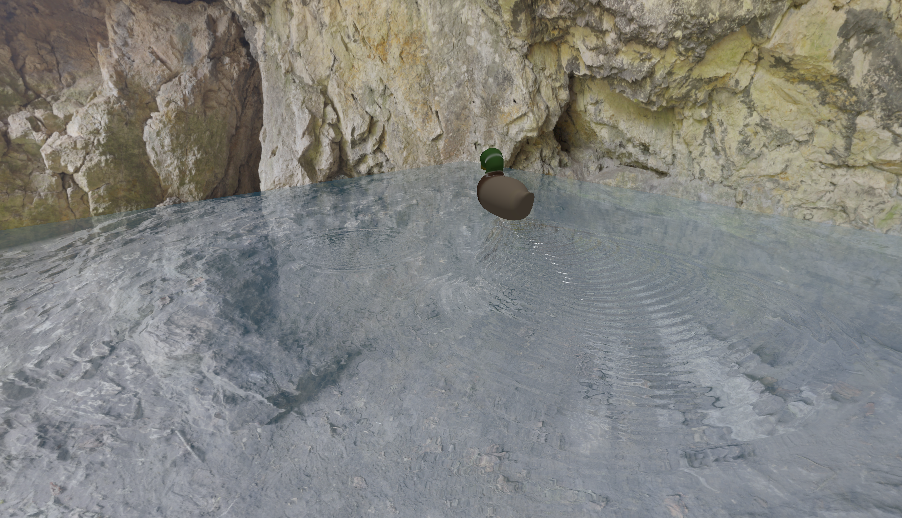
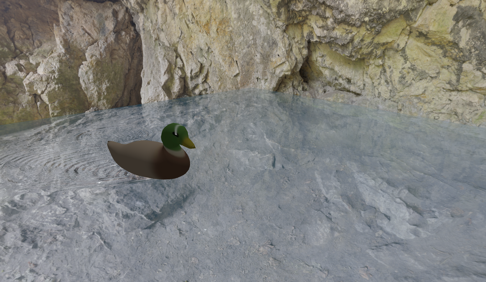
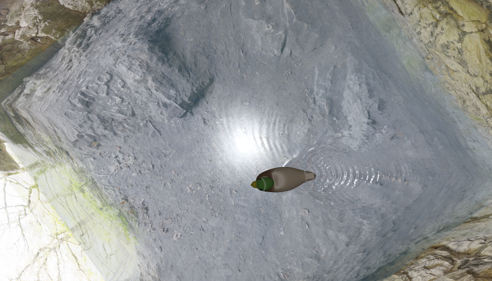
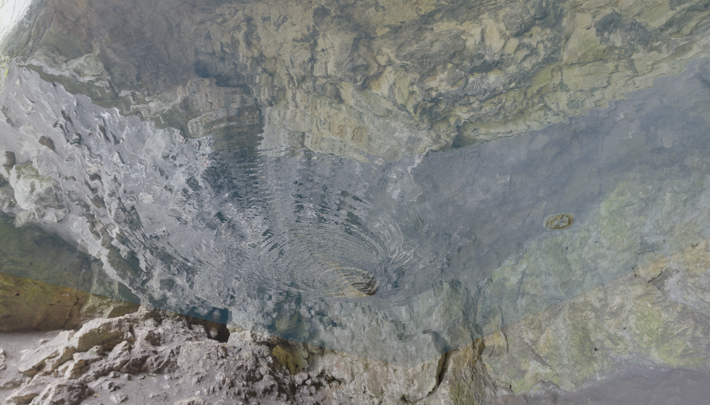

# Duck

A real-time water simulation and rendering demo written in Rust with `wgpu` and WGSL shaders. The scene contains an animated water surface, a cubemap environment, and a duck moving along a procedurally generated B-spline path.

## Implemented Features

- GPU water simulation on a 256x256 grid using a finite-difference approximation of the wave equation.
- Rain drops generated randomly during the simulation, producing local height disturbances.
- Reflection and refraction calculated from the view direction and the sampled water normal, with their contributions blended using an approximation of the Fresnel term.
- Procedural cubic B-spline motion with random control points.

## Running

A working Rust toolchain and a graphics device with `wgpu` support are required.

```bash
cargo run --release
```

The required mesh, duck texture, cubemap faces, and shaders are included in the repository and embedded into the application at compile time.

## Controls

- LMB - move orbit camera around the center
- RMB - zoom

## Examples








